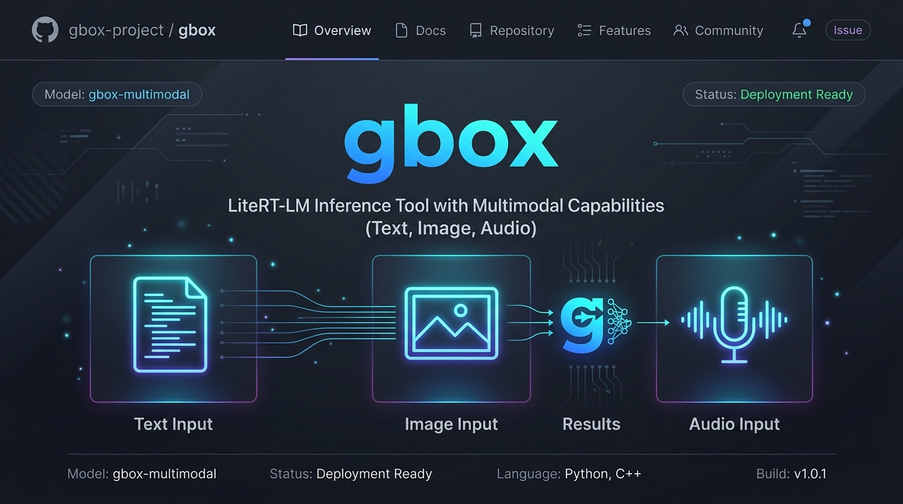

# gbox — Local, Free, Multimodal AI on Your Mac



**100% local. 100% free. No API keys, no usage caps, no telemetry, no cloud round-trips.**

`gbox` is a command-line wrapper around Google's [LiteRT-LM](https://github.com/google-ai-edge/LiteRT-LM) runtime and Google's open [Gemma 3n](https://ai.google.dev/gemma) models, optimized for Apple Silicon. It gives you a multimodal AI assistant — text, image, audio, PDF — that runs entirely on your own hardware, with first-class shell ergonomics and a real tool-calling system.

## Why gbox?

- 🆓 **Free forever** — no subscription, no token billing. The models are open-weight and downloaded once.
- 🏠 **Fully local & private** — every byte of your prompts, files, screenshots, and audio stays on your machine. Nothing leaves the box.
- ⚡ **Fast on Apple Silicon** — backed by Google's LiteRT-LM with Metal GPU acceleration, plus an optional warm-server mode that eliminates the model-load penalty.
- 🧰 **Real tool calling** — the model can read your filesystem, run AppleScript, query SQLite, OCR images, control macOS, search the web, and more — gated by an explicit `--tools` allowlist.
- 🔌 **OpenAI-compatible API** — drop-in `/v1/chat/completions` endpoint so existing OpenAI client code works unchanged against your local model.
- 🐚 **Unix-native** — pipes, stdin, exit codes, streaming. Composes with the rest of your shell.

### Built on Google's open AI stack

- **[LiteRT-LM](https://github.com/google-ai-edge/LiteRT-LM)** — Google AI Edge's on-device LLM runtime ([overview](https://ai.google.dev/edge/litert)).
- **[Gemma 3n](https://ai.google.dev/gemma/docs/gemma-3n)** — Google's multimodal open models designed for edge devices ([model card](https://huggingface.co/google/gemma-3n-E4B-it-litert-lm)).

## Features

- **Multimodal Support**: Seamlessly handle text, images, and **audio** in a single prompt.
- **PDF Intelligence**: Automatically detects piped PDFs, extracting text and rendering the first page for the vision backend.
- **Structured Output**: Enforce strict JSON responses using the `--schema` flag.
- **Real-Time Streaming**: Use the `--stream` flag to see the model's response as it generates.
- **Clipboard Output**: Pass `-c` / `--clipboard` to copy the final result straight to the macOS clipboard.
- **System Instructions**: Inject system-level instructions or named Fabric patterns using the `--system-file` flag.
- **Modular Tooling**: Enable specific tools or predefined tool sets from a modular `tools/` package.
- **Context Awareness**: Inject conversation history via JSONL or raw text context via Markdown using the `--context` flag.
- **Smart Recommendations**: Suggests using the `--high` (4B) model when complex tools (like AppleScript, SQLite, or macOS system automation) are requested.
- **Unix-Friendly**: Designed for piping and shell automation.

## Installation

Ensure you have the `litert_lm` package installed. For full features, install these dependencies:

```bash
# Required for PDF support
uv pip install pymupdf

# Recommended for specific tools
brew install poppler exiftool sox ffmpeg imagemagick
```

## Usage

### Basic Inference
You can provide the prompt via the `--prompt` flag or as a positional argument.

```bash
# Positional (concise)
gbox "What is the capital of France?"

# Using the flag
gbox --prompt "Hi there!"

# Using a file as a prompt
gbox --prompt instructions.txt

# With real-time streaming
gbox --stream "Write a long poem"

# Copy the result to the clipboard (also works with --json / --stream)
gbox -c "Draft a tweet about on-device inference"
```

### Multimodal (Image & Audio)
If no prompt is provided with an image or audio, a default one like "Describe this image" is used.

```bash
# Implicit prompt
gbox --image photo.jpg

# Explicit prompt
gbox --audio clip.wav --prompt "Transcribe this audio"
```

### macOS Power Features
The `mac` tool set allows deep integration with macOS.

```bash
# Analyze a selection of your screen (triggers crosshair)
gbox --tools mac "Analyze the part of my screen I'm about to select"

# Finder integration
gbox --tools mac "Summarize the files I have currently selected in Finder"

# Web Browser context
gbox --tools mac "What is the URL of the site I'm looking at?"

# System control
gbox --tools mac "Switch to dark mode and say 'Good evening'"
```

### Model Selection
The tool defaults to `gemma-4-E2B-it`.
```bash
# Use the 4B model (Higher reasoning)
gbox --high --prompt "Explain quantum decoherence."

# Explicitly use the 2B model
gbox --default --prompt "Who are you?"
```

### Selective Tools
Enable only the tools required for the task. The tool will suggest `--high` if complex tools are enabled.

```bash
# Enable specific tools and sets
gbox --presets preset.py --tools "calculator,fs" --prompt "Find data.csv and calculate the mean"
```

### Context and History
Inject prior context or full conversation history.

```bash
# Use a Markdown file as prior context
gbox --context context.md --prompt "Explain based on above"

# Use a JSONL file for full message history
gbox --context history.jsonl --prompt "Continue our chat"
```

**Available Sets in `preset.py`:**
- `fs`: File system (read, write, list, find, grep)
- `web`: Web (fetching, DuckDuckGo search)
- `sys`: System (time, clipboard, shell, AppleScript/JXA)
- `media`: Media (OCR, conversion, metadata)
- `audio`: Recording and conversion
- `dev`: Git workflow (status, diff)
- `utils`: Math and SQLite queries
- `mac`: macOS Power Features (Shortcuts, Finder selection, Spotlight search, TTS, Browser info, System Appearance, Screenshots/OCR, Launchd LCRUD)

See [CONTRIBUTING.md](CONTRIBUTING.md) for a guide on adding your own tools.

### Structured JSON Output
```bash
# schema.json: {"type":"object", "properties": {"sentiment": {"type":"string"}}}
echo "I love this tool!" | gbox --schema schema.json --json
```

## Server Mode

gbox can run as a background service to keep the model "warm," significantly reducing the latency of subsequent requests by avoiding repeated model loading.

### Automatic Server Diversion (Smart Proxy)
When you run a standard `gbox` command, it will automatically check if a compatible server is already running. If the server's model and loaded tools satisfy your request, `gbox` will transparently divert the inference to the server. 

**Benefits:**
- **Near-Zero Latency:** Avoids the 3-10 second model loading penalty.
- **Resource Safety:** Prevents multiple model instances from overloading your system's VRAM/RAM.

If the server is incompatible (e.g., you requested `--high` but the server is running the default model), `gbox` will fall back to local execution. Use the `--no-server` flag to force local execution regardless of server status.

### Control Subcommands
- **Start**: `gbox --server start` (or simply `gbox --server`) - Daemonizes the process.
- **Stop**: `gbox --server stop` - Terminates the background process.
- **Status**: `gbox --server status` - Checks if the server is running.
- **Logs**: `gbox --server logs` - Tails the server output from `~/.gbox/server.log`.
- **Config**: `gbox --server config` - Prints the running server's active model, tools, and limits (proxies `GET /config`).
- **Models**: `gbox --server models` - Lists models the running server can load (proxies `GET /models`).

### API Usage
The server listens on port **8955** by default and provides OpenAI-compatible endpoints:
- `POST /v1/chat/completions`
- `POST /infer`
- `GET /config` (returns active model, tools, and limits)
- `GET /models` (OpenAI-shaped list of available models)

#### Sample JSON Request (Non-Streaming)
```bash
curl http://localhost:8955/v1/chat/completions \
  -H "Content-Type: application/json" \
  -d '{
    "model": "gemma-4-E2B-it",
    "messages": [
      {"role": "system", "content": "You are a helpful assistant."},
      {"role": "user", "content": "Explain gravity in one sentence."}
    ],
    "stream": false
  }'
```

#### Sample JSON Request (Streaming)
```bash
curl http://localhost:8955/v1/chat/completions \
  -H "Content-Type: application/json" \
  -d '{
    "messages": [{"role": "user", "content": "Count to 5 slowly."}],
    "stream": true
  }'
```

## Options

| Flag | Description |
|------|-------------|
| `--prompt` | The user text prompt (or path to a prompt file). |
| `--image` | Path to an image file. |
| `--audio` | Path to an audio file. |
| `--system-file` | Named Fabric pattern or system file (system prompt). |
| `--schema` | Path to a JSON schema file. |
| `--context` | Path to JSONL (history) or Markdown (text) file. |
| `--json` | Output strict JSON (cleans markdown filler). |
| `--stream` | Stream the response in real-time. |
| `-c`, `--clipboard` | Copy the final result to the macOS clipboard (via `pbcopy`). |
| `--no-server` | Disable automatic server diversion. |
| `--server` | Server control: `start`, `stop`, `status`, `logs`, `config`, `models`. |
| `--port` | Port for the inference server (default: 8955). |
| `--tools` | Comma-separated list of tools or sets. |
| `--presets` | Path to your `preset.py` file. |
| `--default` | Force `gemma-4-E2B-it`. |
| `--high` | Force `gemma-4-E4B-it`. |
| `--backend` | Engine backend (`cpu` or `gpu`). Defaults to `gpu` on Apple Silicon. |
| `--vision-backend` | Vision backend (`cpu` or `gpu`). Defaults to `gpu` on Apple Silicon. |
| `--audio-backend` | Audio backend (`cpu` or `gpu`). Defaults to `cpu`. |
| `--max-tokens` | KV cache size (default: 4096). |

---

## Support

If this project helps you keep your AI workflows local and free, consider buying me a coffee! It helps keep the updates coming.

<a href="https://paypal.me/2b3/5">
  
</a>

**[https://paypal.me/2b3/5](https://paypal.me/2b3/5)**

---

## License

MIT License - Created by [Ian Shen](https://github.com/2b3pro).
